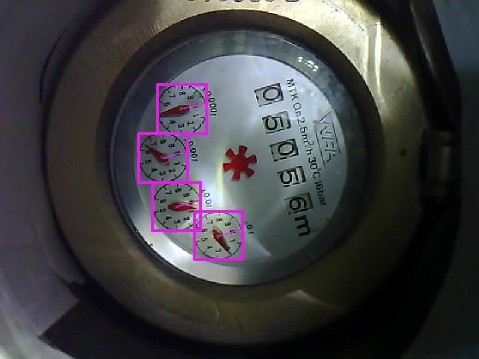

# README

ppf.watermeter reads your analog watermeter from a photo. The package provides
python code to use in your own scripts as well as a command line tool
`read_meter` if you don't feel like programming.


## Usage

```shell
read_meter --s_prev 5114.4425 --ds_mean 0.0026 config.tsv <image.bmp>
```

where config.tsv is a configuration file specifying where the hands are,
`--s_prev` specifies the previous reading of the watermeter, and `--ds_mean`
specifies the expected increment between two readings. If these arguments are
not provided, `read_meter` will still read the image but will not use a priori
knowledge to improve the reading. Also, it will assume that the non-analog
digits (the rotating number-wheels) show zero.


## Configuration

`read_meter` needs a bit of configuration to know where the hands are located
and how they are oriented in the image. Also, we have to tell it how to best
process the image to separate hands from background.



The configuration file corresponding to the above image is shown below. It has
one row for every hand to be read. The columns provide:

* x0: column number of upper left corner of the clock square
* y0: row number of upper left corner of the clock square (row 0 is top row)
* w : width (and height) of the clock square
* phi: rotate by this angle (clockwise, degrees) to make digit 0 point upwards


```csv
#clock	x0	y0	w	phi
x0.0001	265	148	83	-74.4
x0.001	235	228	81	-74.4
x0.01	258	310	80	-74.4
x0.1	327	359	80	-74.4
```

There is *no* configuration for the non-analog digit indicators.
`ppf.watermeter` will not *read* these. Instead, it will *track* them. Every
time an overflow of the analog digits is detected (x0.1 m^3 hand in the example
image has completed a full turn), the value of the next higher digit (x1 m^3 in
the example) increments.


## Installation

```shell
pip install ppf.watermeter
```


## How it works

### Cropping

`read_meter` reads the pink squares from the image, only, avoiding
unnecessary memory consumption. The cropped reading uses `x0`, `y0`, and `w`
from the configuration file.


### Color processing

First, `ppf.watermeter` converts the RGB image to HSV color space, using only
the Hue channel (H). There, it selects the typical red color of the hands to
obtain a grayscale image where the hands are white on a black background.

Currently, the hue range is hard-coded. Future versions of `ppf.watermeter` may
change this to a configuration parameter.


### Polar coordinates

Next, `ppf.watermeter` converts the cropped grayscale image to polar
coordinates and determines the angle of the center of gravity as well as the
width of the hand. The width is used as an indicator of uncertainty. Also, we
use `phi` from the configuration file to correct for the rotation of the image,
and we convert the angle to a digit in [0, 10[.

Now, we have information similar to this:

```
x0.1: (4.3649 ± 0.0625)
x0.01: (4.9275 ± 0.0625)
x0.001: (2.8150 ± 0.0617)
x0.0001: (3.4867 ± 0.0602)
```


### Maximum likelihood estimation

We use a Bayesian approach to determine the most likely watermeter state given
the observed hand positions and error bars. If hand x0.1 reads 4.36 this does
not only indicate that this digit is likely to be 4, but also that the next
lower digit (x0.1) is likely to be near 3.6.

If the previous reading is provided as an argument, we will also use this as
follows: We know that the watermeter cannot run backwards, and we know the
expected increment between two readings. We further assume an exponential
distribution starting at the previous reading with an appropriate expected
value as a priori distribution.

Combining this knowledge we determine the most likely watermeter state.


## Project goals

* connect analog watermeters to homeassistant


Project overview

* esp32-cam
* take still images
* detect hands of analog digit indicators
* Bayesian filter to determine most likely digit combination
* homeassistant api
* MQTT


## Project structure

* web interface to configure:
    - camera- and illumination settings (brightness of illumination, exposure
      time, gain)
    - sampling rate (how often to take images)
    - image-processing parameters to separate hands from background
      (black point, white point, gamma correction, unsharp masking)
    - pixel-processing settings to convert an (r, g, b) triplet to a gray
      scale value f(r, g, b) indicating the presence (or not) of a hand
    - location, size, and orientation of analog digit indicators
    - *no* configuration for non-analog digit indicators (rotating
      number-wheels). We will not read these. Instead, we will track overflows
      of the (smaller) analog digit indicators to determine the value of the
      (higher) non-analog digit indicators, anyway.
    - first reading of water meter (including analog and non-analog
      digit indicators). Assumed uncertainty is 0.5 units of the lowest
      indicator.
    - minimum and maximum possible change of reading between two images (for
      Bayesian filter). Initial assumption: Any change within that interval has
      the same probability.
    - homeassistant settings
    - MQTT settings
    - yaml-based configuration file
* business logic:
    - pixel-processing function f to convert an (r, g, b) triplet to a gray
      scale value f(r, g, b) indicating the presence (or not) of a hand
    - for each indicator using this indicator's configuration:
        * scan grid of polar coordinates [0, 360] deg x [0.5, 1] radius
        * convert polar coordinates to Cartesian coordinates
        * read f(r, g, b) of that pixel ...
        * ... and calculate weighted average of Cartesian coordinates (*not* of
          polar coordinates)
        * convert weighted average back to polar coordinates
        * convert polar coordinates to digit value in [0, 10[ (as float, not
          yet rounded to integer)
    - Bayesian filter to determine most likely digit combination:
        * for each digit in turn:
            - using the value of digit 10**n (e.g., 5.6)
            - and value of digit 10**(n-1) (e.g., 5.7)
            - and the uncertainty of each reading
            - to calculate the most likely hand position (given that the higher
              digit is near 5.*6*, the lower digit should be near 6.
        * use most likely digit combination (and its uncertainty) and
          prediction from previous reading (and uncertainty) to obtain most
          likely final result (including uncertainty)
        * when highest digit overflows, add 1 to the even higher, non-analog
          digit indicator (that we do not read from the image)
    - send result to homeassistant via api
    - publish result to MQTT topic


## Where we are now

* Experimenting with GIMP showed that we can convert watermeter images to
  grayscale where the hands are white on featureless black background
* using the clock areas (squares) determined in GIMP, we did
    - the grayscale conversion in ImageMagick
    - converted the result to polar coordinates
    - read the hands positions including an error bar from these polar
      coordinates
    - corrected for the known rotation of the entire image
* we had to write a little python script to determine the center of gravity of
  a grayscale image (ImageMagick can't do this, apparently)
* UPDATE: We do the image processing in python now, instead of ImageMagick
* from the 4 hand positions and error bars, we determined the most likely 4
  digit number they are indicating
* we have adjusted the initial estimate of the image rotation determined from
  GIMP to maximize the likelihood of the 4 digit number (and confirmed the
  better result by looking at the image)
* we record a series of images by using an automation in homeassistant. We had
  to set fixed exposure and gain to avoid oscillations in image brightness. We
  also had to introduce delays between turning on the illumination and taking a
  picture as well as between taking a picture and turning off the illumination


### Maximum Likelihood Estimation

We use a Baysian approach to determine the most likely watermeter state given
the observed hand positions and error bars.

Let's say the liter hand reads 1.2. Is this 11.2 liters? Or 21.2? Or 31.2? Of
course, we have to consider the 10-liter hand. But quite often, the situation
remains ambiguous. It may be relatively clear (even to the human eye) that it
must be either 11.2 or 21.2, certainly not 31.2, but that's still two options.

We do the following: First, we plot a horizontal s-axis showing the interval
[0, s_max[, where s_max is the largest number we can represent with the given
number of hands. Then, we calculate for each hand:

s_i = (s / 10**i) % 10

i indicating the power of ten of the hand. s_i is what hand i should read if
the watermeter's state is s. Note that s_i repeats - very often for the smaller
hands, only once for the largest hand.

Now we can plot the (log-) likelihood f_i(s_i(s)) which is a superpositions of
combs of Gaussians along s (one comb for each hand).


#### The Wrapping Problem

There is still a challenge, though. The problem is the circular nature of the
clocks. If the hand is between 0 and 1 with an error bar of 0.2, there is a
decent chance that the hand is actually at 9 - a much higher number than 1. But
there is zero chance that the hand is on a negative digit (there are no
negative digits). But a Gaussian centered close to 0 *will* have non-zero
density below zero. The probability density needs to "wrap around".

This is very annoying because "wrapping" the distribution means adding up all
the Brillouin zones. This infinite sum poses two problems:

* we don't have infinite time
* as it is a *sum* and not a *product* of (non-logarithmic) densities, we
  cannot avoid multiplication of exponentials by simply switching to
  log-likelihoods

We address this as follows: We note that the error bar is always a lot narrower
than 360 deg. Therefore, we can reasonably approximate the infinite sum by a
sum over only the lowest order Brillouin zones. But not to a single one as the
hand may be near zero, spilling a lot of probability to the neighboring zone.

Next, we *center* the probability distribution at 5: If the estimate is 1.2, we
remember this but declare 1.2 to be the new 5. Now, the probability densities
at 0 and at 9.999... become very small, spilling very little probability into
neighboring zones. Voila, there is no sum anymore and we can apply the
log-likelihood trick, thereby avoiding the calculation of exponentials and
replacing multiplications by additions.


#### A Priori Distribution

We know the previous state estimate s_prev, we know that the meter will not run
backwards, and we know expected increment between two readings. Either because
we have asked the user at configuration time or because we derive it from past
readings or both.

Therefore, we use an exponential distribution starting at s_prev (or a little
before that to account for error bars) with an appropriate expected value as a
priori distribution P(s):

P(s) = exp(-(s - s_prev) / sigma)

where sigma is the expected increment between two readings.

Now, we face the wrapping problem again: If the previous read was already close
to the maximum value representable by the number of hands we have, a lot of
density that "spills" into the "overflow" zone. Also, the range where P(s) = 0
is somewhat uncomfortable as log(0) = -inf. We avoid both problems by
restricting the range of s to [s_prev, s_prev + s_max[ (instead of [0, s_max[
as used in the previous section).


#### A Posteriori Distribution

It turns out (RRR) that the a-posteriori distribution is the product of the
a-priori distribution and the multi-comb of Gaussians we already explained
above.


#### Maximum Likelihood

We now have the density P(s) of the a-posteriori distribution and have to
identify the (position of its) maximum - efficiently.
