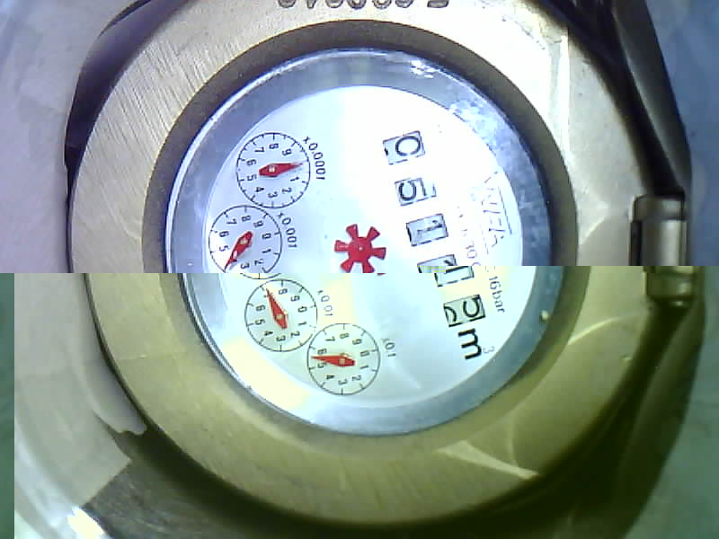
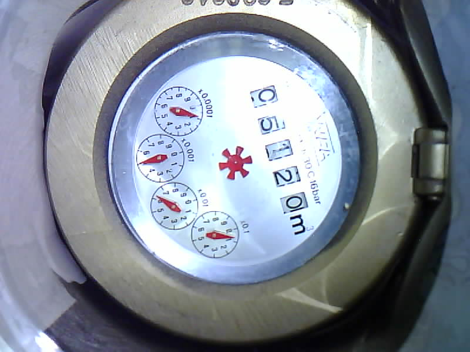
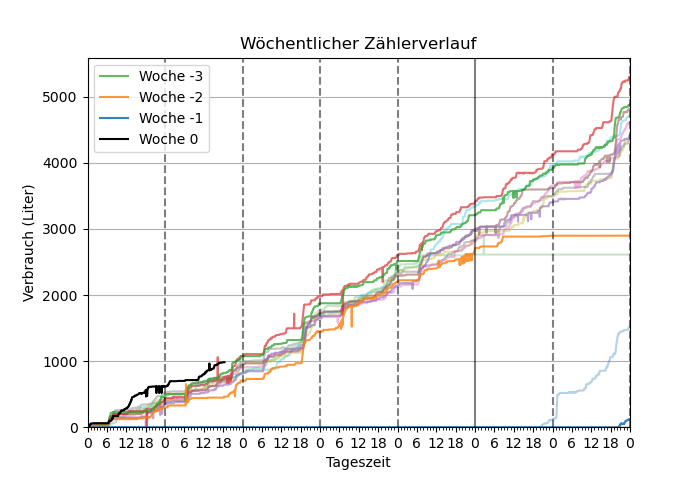
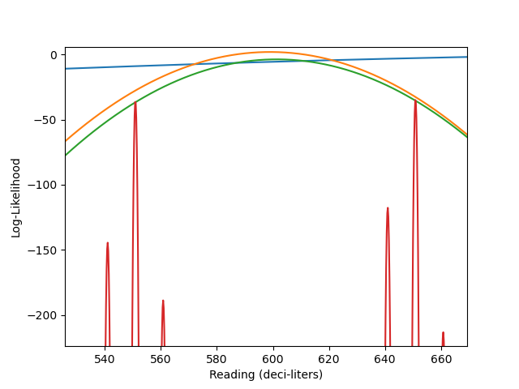
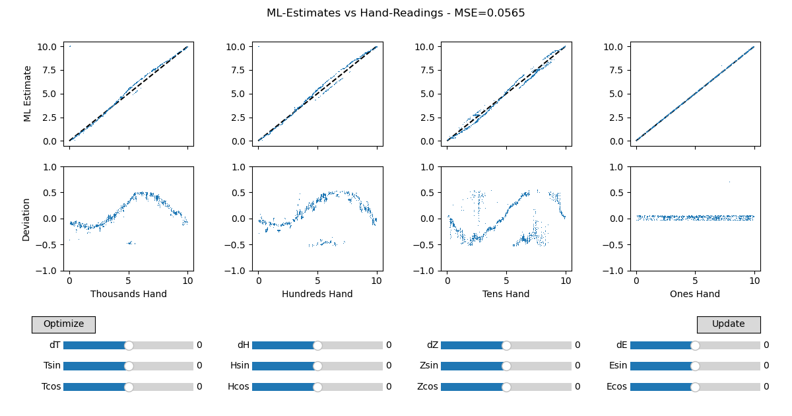
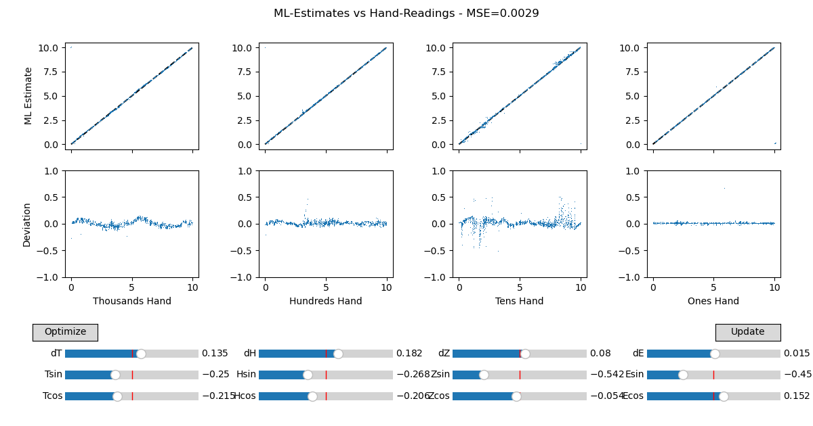
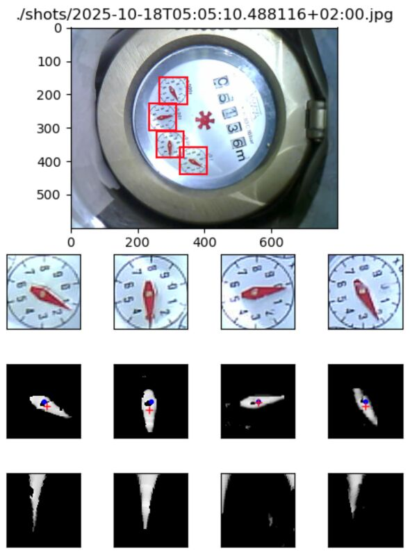

# Tricky Cases

Here, I discuss cases / situations that led to difficulties, analyze the root
causes, and describe how they were resolved.

## Damaged or Corrupted Images

Sometimes, images received from the camera are corrupted.

So far, I don't know whether this happens in camera, on the ESP32 module,
during transmission to HA, or on HA. I think it does not happen during ssh
transfer from HA to my computer. Maybe, the problem will go away as soon as I
move the image processing to the ESP32 module.

## Toggling Watermeter Readings

Sometimes, the watermeter readings toggle back and forth between two values.
This is particularly obvious when the watermeter is actually not turning.

The picture below shows an example where the reading toggles between ~0.05509 m3
and ~0.06509 m3. As a humen, I say 0.06509 m3 is correct.

In the consumption graph, this looks like shown below (e.g. black curve on
Monday after 18h or orange curve late on Friday):

What is happening? The log-likelihood function (red curve in plot below) shows
that two readings have very similar likelihoods. Depending on very small
variations in the image, on or the other peak is the higher one and the reading
toggles.

But why is that? The hand readings leading to this log-likelihood function are
somewhat different from what a human would read:

* 0.1x:     0.84 => ok
* 0.01x:    5.99 => should be ~6.2!
* 0.001x:   4.96 => ok, maybe a little low
* 0.0001x:  0.91 => ok

We learn:

* The 0.01x hand in the original picture is a bit low. It points to ~62 liters.
  It should point to 65 liters.
* ppf.watermeter reads it as even lower: Almost exactly at 60 liters.
* The 0.001x hand reads 5 liters. But is this now 55 liters or 65 liters? With
  0x01x at 60 liters, both are equally likely.

The hand reading of 0.01x is significantly and relevantly off. If it would be
6.2 (as a human would read it), we would not have this problem.

The following figure shows actual hand readings versus hand readings derived
from the maximum likelihood estimate (MLE) (derived from those hand readings).
We can assume that the MLE is correct or at least more correct that the raw
hand readings.

We see:

* small bias (systematic error)
* s-curve patterns
* "branching"

The branching is particularly interesting. It means that for some hand reading
values, there are two MLE values. This is exactly what we have seen in the
toggling case above. If the hand reading is too far off from the true value,
the next higher or lower value becomes more likely.

We have fixed this problem by introducing a correction function: A given hand
reading is adjusted by adding an offset (we already had this), a sine
correction Asin * sin(phi), and a cosine correction Acos * cos(phi), where phi
is the angle of the hand. After this correction, the result looks like this:

The branching is gone. The s-curve patterns are much reduced. The tens hand
does not yet look perfect, although better than before. I have looked at some
of the (many) outliers, and they seem to be reading errors: The tens hand is
sometimes close to 180 degrees off from where it should be. Image processing
problem?

## Theta Wrapping

One problem leading to the "tens hand" reading errors mentioned above is
related to the wrapping of angles at 0/360 degrees in polar coordinates: If the
hand is close to 0 degrees, a part of it will show near 360 degrees. Taking the
average of those angles will result in an estimate close to 180 degrees, which
is very wrong.

However, we already anticipated this problem and first estimate the center of
gravity of the hand in cartesian coordinates. Then we use this for an initial
estimate of the hand's angle and do the polar transform *centered* on this
angle. This should avoid the wrapping problem except in cases where our initial
estimate is very wrong.

Well, look at this:

The tens hand wraps in polar coordinates. This happens because:

* the centering of the crop is not perfect. The actual center of rotation is
  significantly left of the crop center. This shifts the center of gravity of
  the cartesian image to the left.
* there are some bright pixels on the left and on the bottom. These shift the
  center of gravity - which is already close to the center of the image -
  further to the lower left.

Counter measures:

1. Make COG estimation more robust: Set the center circle of the cartesian
   image to zero before computing the COG. This avoids that the hand itself
   already has a COG close to the center (due to its central part and due to
   its "hind end").
2. Adjust cropping so that center of rotation is more accurately centered.
   I do this manually for my meter installation. For our users, we should
   provide a tool that clearly indicates the center of the crop and maybe
   clearly indicate this problem in the setup instructions.
3. Make COG of *polar* image more robust. Removing any bright region that is
   *not* connected to the upper edge of the image seems a very promising
   approach.
4. Think about ways to improve "hand scale conversion" to suppress false bright
   pixels as we have here.
